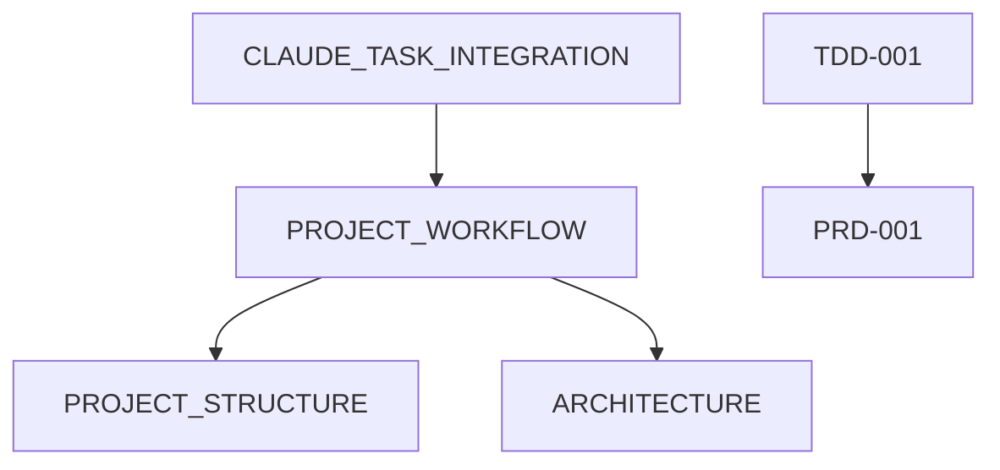

# Documentation Tags Manifest

**Purpose**: Define metadata tags for all documentation to optimize agent context window usage

**Last Updated**: 2026-01-25

---

## Tagging Schema

### Audience Tags

- `pm` - Product Manager
- `architect` - Technical Architect
- `developer` - Feature Developer
- `tester` - Quality Tester
- `design` - Design Reviewer
- `sensei` - Japanese Sensei (content)
- `multi-agent` - All personas

### Priority Levels

- `high` - Load for most tasks (core workflows, frequently referenced)
- `medium` - Load when task-relevant
- `low` - Reference only (load on explicit mention)

### Size Categories

- `small` - <5K tokens (~2500 words)
- `medium` - 5-15K tokens (~2500-7500 words)
- `large` - >15K tokens (>7500 words)

### Status Values

- `active` - Current, authoritative
- `draft` - Work in progress
- `deprecated` - Superseded, for reference only

---

## Current Documentation Tags

### guides/ (How-to workflows)

#### PROJECT_WORKFLOW.md

```yaml
audience: [multi-agent]
priority: high
size: large
dependencies: [PROJECT_STRUCTURE, ARCHITECTURE]
status: active
tags: [workflow, planning, epic, tdd, task]
```

**Reasoning**: All personas use Epic→TDD→Task pattern. High priority but large (18KB), so load when planning/coordinating work.

#### PROJECT_BOARD_GUIDE.md

```yaml
audience: [pm, developer, multi-agent]
priority: medium
size: medium
dependencies: [PROJECT_WORKFLOW]
status: active
tags: [workflow, github, tracking]
```

**Reasoning**: PM and Dev use GitHub board frequently. Medium priority (not every task needs it).

#### CLAUDE_TASK_INTEGRATION.md

```yaml
audience: [pm, architect, multi-agent]
priority: medium
size: large
dependencies: [PROJECT_WORKFLOW]
status: active
tags: [workflow, claude-tasks, coordination]
```

**Reasoning**: PM/Arch for cross-session coordination. Load when creating Claude tasks or planning multi-session work.

---

### standards/ (Rules and conventions)

#### CONTENT_STANDARDS.md

```yaml
audience: [sensei, developer]
priority: medium
size: medium
dependencies: []
status: active
tags: [standards, japanese, jlpt, content]
```

**Reasoning**: Sensei (content validation) and Dev (implementation). Load when working on Japanese content.

#### DESIGN_PRINCIPLES.md

```yaml
audience: [design, developer]
priority: medium
size: medium
dependencies: []
status: active
tags: [standards, ui, ux, design]
```

**Reasoning**: Design reviews and UI implementation. Load when working on frontend/design.

#### TESTING.md

```yaml
audience: [tester, developer]
priority: high
size: small
dependencies: []
status: active
tags: [standards, testing, quality]
```

**Reasoning**: Small (7KB), high priority for any code changes. Always load for implementation tasks.

#### WORKFLOW_EXCEPTIONS.md

```yaml
audience: [multi-agent]
priority: low
size: small
dependencies: [PROJECT_WORKFLOW]
status: active
tags: [workflow, exceptions, reference]
```

**Reasoning**: Reference only - check when considering workflow deviations. Small, so low cost to load if needed.

---

### reference/ (Technical reference)

#### ARCHITECTURE.md

```yaml
audience: [architect, developer]
priority: high
size: medium
dependencies: [PROJECT_STRUCTURE]
status: active
tags: [reference, architecture, technical]
```

**Reasoning**: Core technical reference. High priority for arch/dev work.

#### PROJECT_STRUCTURE.md

```yaml
audience: [multi-agent]
priority: high
size: medium
dependencies: []
status: active
tags: [reference, structure, organization]
```

**Reasoning**: All personas need to know file locations. High priority, medium size.

#### ROADMAP.md

```yaml
audience: [pm, architect]
priority: low
size: large
dependencies: []
status: active
tags: [reference, planning, roadmap]
```

**Reasoning**: PM/Arch for long-term planning. Large (16KB), load only when explicitly planning future work.

---

### Root-Level

#### README.md

```yaml
audience: [multi-agent]
priority: high
size: small
dependencies: []
status: active
tags: [overview, navigation]
```

**Reasoning**: Entry point to documentation. Small, high priority.

---

### specs/ (PRDs)

#### PRD-*.md

```yaml
audience: [pm, architect, multi-agent]
priority: high (when working on that Epic)
size: medium
dependencies: [related TDD]
status: active
tags: [spec, prd, requirements]
```

**Pattern**: Load PRD when working on its Epic or creating its TDD.

---

### tdd/ (Technical Design Documents)

#### TDD-*.md

```yaml
audience: [architect, developer, tester]
priority: high (when implementing tasks)
size: large
dependencies: [related PRD]
status: active
tags: [spec, tdd, technical, algorithms]
```

**Pattern**: Load TDD section when implementing task that references it.

---

## Agent Loading Strategies

### Strategy 1: Persona-Based Filtering

```python
# Developer starting T1.2
persona = "developer"
task = "Implement SM-2 algorithm per TDD-001 §3"

load_docs = filter(docs, where=(
    audience.includes(persona) or audience.includes("multi-agent")
))

# Result: Loads PROJECT_STRUCTURE, ARCHITECTURE, TESTING, TDD-001
# Skips: ROADMAP, CONTENT_STANDARDS, PROJECT_BOARD_GUIDE
```

### Strategy 2: Priority-Based Loading

```python
# Quick bug fix
task_type = "bug-fix"

# Load only high-priority docs
load_docs = filter(docs, where=(
    priority == "high"
))

# Result: ~40KB total (vs 100KB if loading everything)
```

### Strategy 3: Task-Context Loading

```python
# Task mentions "TDD-001 §3"
mentioned_docs = extract_references(task_description)

# Load mentioned + dependencies + high-priority for persona
load_docs = (
    docs_matching(mentioned_docs) +
    dependencies_of(mentioned_docs) +
    filter(docs, where=(priority=="high", audience.includes(persona)))
)
```

### Strategy 4: Progressive Loading

```python
# Start minimal, expand if needed
initial_load = filter(docs, where=(priority=="high", size=="small"))

if task_needs_clarification:
    load_additional = filter(docs, where=(priority=="high", size=="medium"))

if still_unclear:
    load_referenced = docs_mentioned_in(task)
```

---

## Context Window Budget Guidelines

**Target**: <50K tokens for typical task (leaves 150K for conversation)

| Doc Category | Token Budget | Strategy |
|--------------|--------------|----------|
| Core workflow (high+small) | ~10K | Always load |
| Persona-specific (medium) | ~15K | Load if relevant |
| Referenced docs (TDD sections) | ~20K | Load specific sections |
| Context + conversation | ~150K | Reserved |
| **Total** | **~200K** | Planned usage |

---

## Maintenance

### When Adding New Docs

1. Add YAML frontmatter with tags
2. Update this manifest
3. Test agent loading with new tags

### When Updating Docs

1. Check if size category changed (small→medium, etc.)
2. Update `last_updated` timestamp
3. Reconsider priority if doc usage patterns changed

### Quarterly Review

- Audit actual agent loading patterns
- Adjust priority based on usage
- Archive deprecated docs

---

## Future Enhancements

### Smart Caching

```yaml
cacheable: true | false
cache_ttl: 1h | 24h | 7d
```

Frequently loaded docs could be cached in agent context.

### Selective Section Loading

```yaml
sections:
  - name: "§3 SM-2 Algorithm"
    size: medium
    tags: [algorithm, srs]
```

For large TDDs, load only relevant sections.

### Dependency Graph



Visualize doc relationships for smarter loading.

---

**Next Steps**:

1. Add YAML frontmatter to all existing docs
2. Update CLAUDE.md with agent loading instructions
3. Test with representative tasks from each persona
