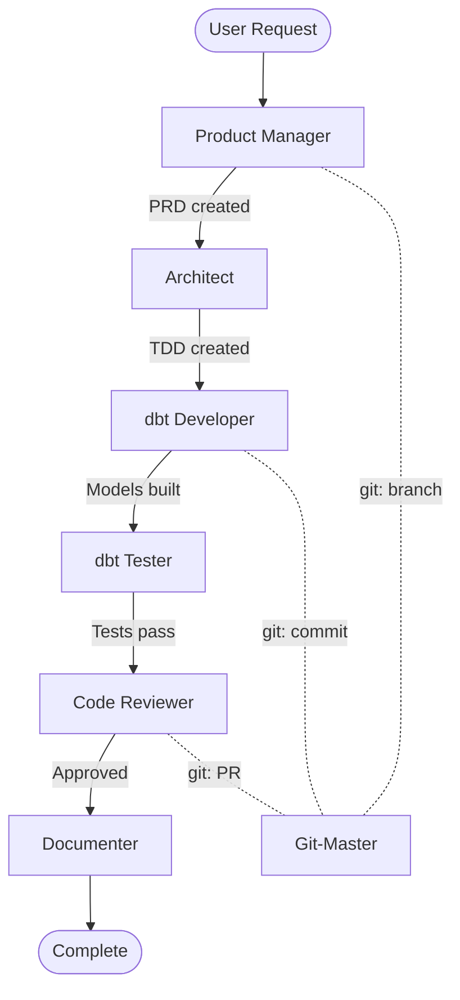

## Overview

### Executive Summary

This PRD defines five interactive playground tools designed to enhance learning, development visibility, and workflow efficiency in the dbt-playground project. These tools transform implicit system knowledge into explorable, visual interfaces that accelerate onboarding, debugging, and feature development.

### Tool Overview

| # | Playground | Purpose | Target Version |
|---|------------|---------|----------------|
| 1 | Agent Orchestration Visualizer | Understand supervisor workflows, handoffs, execution | v0.6.1 |
| 2 | Git Worktree Coordinator | Manage parallel sessions, prevent conflicts | v0.6.0 |
| 3 | Data Lineage Explorer | Trace data flow through dbt DAG | v0.6.2 |
| 4 | Healthcare Data Schema Explorer | Browse Synthea data structure interactively | v0.6.1 |
| 5 | Mermaid Diagram Designer | Create/edit/export architecture & workflow diagrams | v0.6.0 |
| 6 | Dashboard Mockup Builder | Design analytics dashboards visually | v0.6.3 |

### Success Metrics (Global)

- 50% reduction in "where do I find X?" questions
- New contributors productive within 1 session
- Zero cross-worktree conflicts after Coordinator adoption
- Agent workflow failures diagnosed in <2 minutes

---

## Integration Strategy

### Playground Discovery

Users should find playgrounds naturally through existing entry points.

#### 1. CLAUDE.md Integration

Add a new section to CLAUDE.md:

```markdown
## Interactive Playgrounds

Visual tools for learning and development. Launch via commands or explore in the web UI.

| Playground | Command | Purpose |
|------------|---------|---------|
| Agent Visualizer | `/playground:agents` | View agent workflows and handoffs |
| Worktree Coordinator | `/playground:worktrees` | Manage parallel sessions |
| Lineage Explorer | `/playground:lineage` | Trace dbt data flow |
| Schema Explorer | `/playground:schema` | Browse Synthea data |
| Mermaid Diagram Designer | `/playground:mermaid` | Create architecture diagrams visually |
| Dashboard Builder | `/playground:dashboards` | Mock analytics layouts |

Quick start: Run `/playground` to see available tools.
```

#### 2. Agent Suggestions

Agents should suggest relevant playgrounds contextually:

| Agent | Suggests | When |
|-------|----------|------|
| Supervisor | Worktree Coordinator | Creating parallel work tracks |
| Supervisor | Agent Visualizer | Explaining workflow phases |
| Data Modeler | Schema Explorer | Designing new models |
| dbt Developer | Lineage Explorer | Understanding dependencies |
| Semantic Analyst | Dashboard Builder | Defining metrics |

#### 3. Command References

New slash commands for playground access:

```text
/playground                    # List all playgrounds
/playground:agents [workflow]  # Launch Agent Visualizer
/playground:worktrees          # Launch Worktree Coordinator
/playground:lineage [model]    # Launch Lineage Explorer
/playground:schema [table]     # Launch Schema Explorer
/playground:mermaid            # Launch Mermaid Diagram Designer
/playground:dashboards         # Launch Dashboard Builder
```

#### 4. Documentation Updates Needed

| Document | Updates |
|----------|---------|
| CLAUDE.md | Add Playgrounds section |
| AGENTS.md | Add playground suggestions per agent |
| PROJECT_STRUCTURE.md | Add `playgrounds/` directory |
| docs/for_chris/ | Create playground learning guides |

### Technical Architecture

All playgrounds share a common foundation:

```text
playgrounds/
├── common/
│   ├── ui-framework.js       # Shared UI components
│   ├── state-manager.js      # Reactive state management
│   └── api-bridge.js         # CLI/Web communication
├── agent-visualizer/
├── worktree-coordinator/
├── lineage-explorer/
├── schema-explorer/
└── dashboard-builder/
```

#### Implementation Options

| Approach | Pros | Cons | Recommendation |
|----------|------|------|----------------|
| Terminal UI (blessed/ink) | Pure CLI, no browser | Limited interactivity | Schema Explorer |
| Local web server | Rich UI, charts | Extra dependency | Lineage, Dashboard |
| VS Code extension | IDE integration | VS Code lock-in | Future consideration |
| Markdown + Mermaid | Simple, portable | Static only | Agent Visualizer |

**Recommended**: Hybrid approach. Static Mermaid for simple visualization, local web for interactive tools.

---

## Playground 1: Agent Orchestration Visualizer

### Value Proposition

The agent system (`/orchestrate`, Supervisor, horizontal services) is powerful but opaque. Users cannot see:

- Which agent is active during a workflow
- What handoffs occurred and why
- Where a workflow failed or stalled
- How agent dependencies flow

The Visualizer makes agent orchestration **observable**, reducing debugging time and accelerating learning.

### User Personas

| Persona | Use Case | Frequency |
|---------|----------|-----------|
| Learner | Understand how agents collaborate | Weekly |
| Developer | Debug failed orchestrations | Per incident |
| Architect | Design new workflows | Monthly |
| Supervisor | Monitor active tracks | Per session |

### Core Features

#### F1.1: Workflow Diagram Generator

Generate real-time Mermaid diagrams from orchestration execution.

**Input**: Workflow execution log or `/orchestrate` command

**Output**:



**Acceptance Criteria**:

- [ ] Generates diagram from workflow state file
- [ ] Shows completed vs pending vs failed steps
- [ ] Highlights current active agent
- [ ] Shows horizontal service invocations (git-master, changelog)

#### F1.2: Execution Timeline

Display agent execution sequence with timing.

```text
[14:32:05] User: "Add customer analytics"
[14:32:07] Supervisor: Clarifying scope...
[14:32:45] Supervisor: Delegating to /orchestrate
[14:32:46] PM: Creating PRD...
[14:35:12] PM: PRD complete → docs/specs/PRD-015.md
[14:35:13] Architect: Reading PRD...
[14:38:42] Architect: TDD complete → docs/specs/TDD-015.md
```

**Acceptance Criteria**:

- [ ] Timestamp each agent transition
- [ ] Show artifact creation events
- [ ] Display elapsed time per phase
- [ ] Filter by agent or phase

#### F1.3: Dependency Graph

Visualize which agents depend on outputs from others.

```text
                    ┌────────────────┐
                    │   SUPERVISOR   │
                    └───────┬────────┘
                            │ delegates
                    ┌───────▼────────┐
                    │ /orchestrate   │
                    └───────┬────────┘
         ┌──────────────────┼──────────────────┐
         │                  │                  │
    ┌────▼────┐       ┌─────▼─────┐      ┌─────▼─────┐
    │   PM    │◄──────│  ARCH     │◄─────│   DEV     │
    │(PRD.md) │       │(TDD.md)   │      │(*.sql)    │
    └─────────┘       └───────────┘      └───────────┘
```

**Acceptance Criteria**:

- [ ] Show input/output artifacts per agent
- [ ] Highlight missing dependencies
- [ ] Click to view artifact content

#### F1.4: State Inspector

Display current `temp/WORKFLOW_STATE.md` visually.

**Acceptance Criteria**:

- [ ] Parse YAML frontmatter and body
- [ ] Show active/paused/completed tracks
- [ ] Display artifact checklist with status
- [ ] Allow editing state file

### Integration Points

| System | Integration |
|--------|-------------|
| temp/WORKFLOW_STATE.md | Primary data source |
| /orchestrate command | Hook for live tracking |
| Supervisor agent | Suggestions during workflow |
| AGENTS.md | Link to agent definitions |

### Success Criteria

- Workflow failures can be diagnosed without reading logs
- New users understand agent flow after one visualization
- Supervisor can show visualization during `/supervisor` status

### Technical Notes

**Data Source**: Parse `temp/WORKFLOW_STATE.md` YAML and markdown sections.

**Rendering**: Mermaid for diagrams (renders in GitHub, VS Code, terminals with support).

**Live Mode**: Optional WebSocket connection for real-time updates during `/orchestrate`.

---

## Playground 2: Git Worktree Coordinator

### Value Proposition

Git worktrees enable powerful parallel development, but managing multiple worktrees across Claude Code sessions is error-prone:

- Which worktrees exist and what branch is each on?
- Which terminal/session is working on which worktree?
- Are there uncommitted changes that will cause conflicts?
- Has someone else pushed to a branch I'm working on?

The Coordinator provides **visibility and safety** for multi-session development.

### User Personas

| Persona | Use Case | Frequency |
|---------|----------|-----------|
| Solo Developer | Track 2-3 parallel features | Daily |
| Multi-Session User | Coordinate 3+ Claude sessions | Per session |
| Supervisor | View all active work tracks | Per status check |
| Onboarding Developer | Understand worktree workflow | Once |

### Core Features

#### F2.1: Worktree Dashboard

Display all worktrees with status at a glance.

```text
┌──────────────────────────────────────────────────────────────────────────┐
│  GIT WORKTREE COORDINATOR                                     [Refresh] │
├──────────────────────────────────────────────────────────────────────────┤
│                                                                          │
│  MAIN REPOSITORY                                                         │
│  /Users/chris/dbt-playground                                             │
│  Branch: main  |  Status: Clean  |  Last commit: 2h ago                  │
│                                                                          │
├──────────────────────────────────────────────────────────────────────────┤
│                                                                          │
│  ACTIVE WORKTREES                                                        │
│                                                                          │
│  1. dbt-playground--customer-analytics                                   │
│     Branch: feat/customer-analytics                                      │
│     Status: 3 modified files                                             │
│     PR: #42 (Draft) - "feat: add customer analytics"                     │
│     Behind: origin/main by 2 commits                                     │
│     [View] [Commit] [Push] [Remove]                                      │
│                                                                          │
│  2. dbt-playground--tuva                                                 │
│     Branch: feat/tuva-integration                                        │
│     Status: Clean                                                        │
│     PR: #45 (Open) - "feat: integrate Tuva Project"                      │
│     Up to date with origin/main                                          │
│     [View] [Remove]                                                      │
│                                                                          │
├──────────────────────────────────────────────────────────────────────────┤
│  [+ Create New Worktree]                [Fetch All]       [Prune Stale]  │
└──────────────────────────────────────────────────────────────────────────┘
```

**Acceptance Criteria**:

- [ ] List all worktrees from `git worktree list`
- [ ] Show branch, status, and PR for each
- [ ] Indicate dirty working directory
- [ ] Show ahead/behind status relative to main
- [ ] Refresh on demand

#### F2.2: Conflict Prevention

Warn before operations that would cause conflicts.

**Conflict Scenarios**:

| Scenario | Detection | Action |
|----------|-----------|--------|
| Checkout same branch | Git prevents | Show error, suggest alternative |
| Uncommitted changes | `git status` | Warn before switch |
| Diverged from main | `git rev-list` | Suggest rebase |
| PR merge conflict | GitHub API | Highlight in dashboard |

**Acceptance Criteria**:

- [ ] Block creating worktree for already-checked-out branch
- [ ] Warn when worktree is behind main by >5 commits
- [ ] Show merge conflict status from GitHub API
- [ ] Suggest resolution actions

#### F2.3: Session Tracker

Track which Claude Code session is in which worktree.

```text
ACTIVE SESSIONS
┌────────────┬──────────────────────────────┬────────────────┐
│ Session ID │ Working Directory            │ Last Activity  │
├────────────┼──────────────────────────────┼────────────────┤
│ Session 1  │ dbt-playground (main)        │ 5 min ago      │
│ Session 2  │ dbt-playground--customer     │ Active now     │
│ Session 3  │ dbt-playground--tuva         │ 15 min ago     │
└────────────┴──────────────────────────────┴────────────────┘
```

**Implementation Note**: Session tracking requires optional telemetry or naming convention for terminals.

**Acceptance Criteria**:

- [ ] Identify session by working directory
- [ ] Show last activity timestamp
- [ ] Highlight active sessions

#### F2.4: Quick Actions

Common worktree operations with safety guardrails.

| Action | Command | Safety Check |
|--------|---------|--------------|
| Create | `git worktree add` | Verify branch name unique |
| Remove | `git worktree remove` | Check for uncommitted changes |
| Fetch All | `git fetch --all` | None needed |
| Prune | `git worktree prune` | Confirm stale only |
| Create PR | `gh pr create --draft` | Verify pushed |

**Acceptance Criteria**:

- [ ] Create worktree with branch name validation
- [ ] Remove worktree with confirmation if dirty
- [ ] Fetch all remotes across worktrees
- [ ] Prune stale worktree entries

### Integration Points

| System | Integration |
|--------|-------------|
| git worktree | All commands |
| gh CLI | PR status, creation |
| Supervisor | `super: status` includes worktree info |
| WORKFLOW_STATE.md | Cross-reference with active tracks |

### Success Criteria

- No accidental branch conflicts across worktrees
- Users can see all parallel work in one view
- Worktree cleanup happens consistently after merges

### Technical Notes

**Data Sources**:

- `git worktree list --porcelain` for worktree info
- `git status --porcelain` for dirty status
- `gh pr list --json` for PR status

**UI**: Terminal-based dashboard using blessed/ink or simple ASCII tables.

---

## Playground 3: Data Lineage Explorer

### Value Proposition

dbt provides `dbt docs` for lineage, but it requires:

1. Running `dbt docs generate`
2. Running `dbt docs serve`
3. Opening a browser
4. Navigating to the model

The Lineage Explorer provides **instant, contextual lineage** directly in the workflow.

### User Personas

| Persona | Use Case | Frequency |
|---------|----------|-----------|
| dbt Developer | Understand upstream dependencies | Per model edit |
| Data Modeler | Plan new model placement | Per design |
| dbt Tester | Identify test coverage gaps | Per test run |
| Code Reviewer | Verify dependency changes | Per PR review |

### Core Features

#### F3.1: Interactive DAG Viewer

Display the dbt DAG with navigation.

```text
┌─────────────────────────────────────────────────────────────────────────┐
│  DATA LINEAGE: fct_encounters                              [Full DAG]  │
├─────────────────────────────────────────────────────────────────────────┤
│                                                                         │
│  SOURCES                STAGING              MARTS                      │
│  ═══════                ═══════              ═════                      │
│                                                                         │
│  ┌─────────────┐    ┌─────────────────────┐                            │
│  │  encounters │───►│ stg_synthea__       │                            │
│  │  (raw)      │    │   encounters        │───┐                        │
│  └─────────────┘    └─────────────────────┘   │                        │
│                                               │    ┌────────────────┐  │
│  ┌─────────────┐    ┌─────────────────────┐   ├───►│ fct_encounters │  │
│  │  patients   │───►│ stg_synthea__       │───┤    │ [SELECTED]     │  │
│  │  (raw)      │    │   patients          │   │    └────────────────┘  │
│  └─────────────┘    └─────────────────────┘   │                        │
│                                               │                        │
│  ┌─────────────┐    ┌─────────────────────┐   │                        │
│  │  providers  │───►│ stg_synthea__       │───┘                        │
│  │  (raw)      │    │   providers         │                            │
│  └─────────────┘    └─────────────────────┘                            │
│                                                                         │
├─────────────────────────────────────────────────────────────────────────┤
│  Selected: fct_encounters                                               │
│  Type: TABLE | Rows: ~15,000 | Last Run: 2h ago | Tests: 8 (all pass)   │
│  [View SQL] [View Tests] [Run Model] [Show Downstream]                  │
└─────────────────────────────────────────────────────────────────────────┘
```

**Acceptance Criteria**:

- [ ] Display upstream and downstream models
- [ ] Color-code by layer (source, staging, intermediate, marts)
- [ ] Show model metadata (materialization, row count)
- [ ] Navigate by clicking nodes

#### F3.2: Upstream/Downstream Analysis

Answer "what feeds this?" and "what does this feed?"

```text
/playground:lineage fct_encounters --upstream

UPSTREAM DEPENDENCIES (fct_encounters)
======================================

Level 1 (Direct):
  - stg_synthea__encounters
  - stg_synthea__patients
  - stg_synthea__providers
  - stg_synthea__organizations
  - stg_synthea__payers
  - dim_date

Level 2 (Transitive):
  - source: synthea.encounters
  - source: synthea.patients
  - source: synthea.providers
  - source: synthea.organizations
  - source: synthea.payers

Total: 11 upstream dependencies
```

**Acceptance Criteria**:

- [ ] Show dependencies by level
- [ ] Distinguish direct vs transitive
- [ ] Include sources in lineage
- [ ] Count total dependencies

#### F3.3: Impact Analysis

Show what would be affected by changing a model.

```text
/playground:lineage stg_synthea__patients --impact

IMPACT ANALYSIS: stg_synthea__patients
======================================

DOWNSTREAM MODELS AFFECTED: 6
  - dim_patients (direct)
  - int_patients__with_conditions (direct)
  - fct_encounters (via dim_patients)
  - fct_clinical_events (via dim_patients)
  - fct_encounters_monthly (via fct_encounters)
  - fct_encounters_yearly (via fct_encounters)

TESTS AFFECTED: 23
  - 8 in dim_patients
  - 5 in int_patients__with_conditions
  - 10 in downstream facts

RECOMMENDATION: Run `dbt build --select stg_synthea__patients+`
```

**Acceptance Criteria**:

- [ ] List all downstream models
- [ ] Show transitive impacts
- [ ] Count affected tests
- [ ] Suggest dbt command for rebuild

#### F3.4: Lineage Diff

Compare lineage between git refs.

```text
/playground:lineage --diff main..feat/customer-analytics

LINEAGE CHANGES (main → feat/customer-analytics)
================================================

NEW MODELS (3):
  + dim_customers
  + fct_customer_orders
  + int_customer__enriched

MODIFIED MODELS (1):
  ~ fct_encounters (added customer_key column)

NEW DEPENDENCIES:
  stg_synthea__patients → dim_customers
  dim_customers → fct_customer_orders

REMOVED DEPENDENCIES:
  (none)
```

**Acceptance Criteria**:

- [ ] Compare lineage between git refs
- [ ] Show added/removed/modified models
- [ ] Show new/removed dependency edges
- [ ] Integrate with PR review

### Integration Points

| System | Integration |
|--------|-------------|
| dbt manifest.json | Primary data source |
| dbt run_results.json | Row counts, timing |
| dbt test results | Test pass/fail status |
| git diff | Lineage comparison |

### Success Criteria

- Developers understand model dependencies without `dbt docs serve`
- Impact analysis prevents breaking downstream models
- PR reviews include lineage diff

### Technical Notes

**Data Source**: Parse `target/manifest.json` (run `dbt compile` first).

**Caching**: Cache manifest parsing, invalidate on dbt runs.

**Visualization**: Mermaid for static, D3.js for interactive web view.

---

## Playground 4: Healthcare Data Schema Explorer

### Value Proposition

Synthea generates 16+ tables with hundreds of columns. Understanding the data requires:

1. Reading the Synthea wiki
2. Querying tables manually
3. Cross-referencing code systems (SNOMED, RxNorm, ICD-10)

The Schema Explorer provides **immediate data understanding** with sample values and relationships.

### User Personas

| Persona | Use Case | Frequency |
|---------|----------|-----------|
| Data Modeler | Understand source schema | Per design |
| Healthcare Analyst | Learn clinical data patterns | Ongoing |
| dbt Developer | Find column to use | Per model |
| New Contributor | Understand Synthea data | Once |

### Core Features

#### F4.1: Table Browser

Navigate all Synthea tables with metadata.

```text
┌─────────────────────────────────────────────────────────────────────────┐
│  HEALTHCARE SCHEMA EXPLORER                           [Search: ______] │
├─────────────────────────────────────────────────────────────────────────┤
│                                                                         │
│  SYNTHEA SOURCE TABLES (16)                                             │
│                                                                         │
│  Core Entities                      Clinical Events                     │
│  ──────────────                     ───────────────                     │
│  ▸ patients (500 rows)              ▸ encounters (15,234 rows)          │
│  ▸ providers (142 rows)             ▸ conditions (8,456 rows)           │
│  ▸ organizations (28 rows)          ▸ medications (12,891 rows)         │
│  ▸ payers (10 rows)                 ▸ procedures (6,234 rows)           │
│                                     ▸ observations (45,678 rows)        │
│  Reference Data                     ▸ immunizations (4,321 rows)        │
│  ──────────────                     ▸ allergies (1,234 rows)            │
│  ▸ careplans (3,456 rows)           ▸ imaging_studies (567 rows)        │
│  ▸ supplies (890 rows)                                                  │
│  ▸ devices (234 rows)               Financial                           │
│                                     ──────────                          │
│                                     ▸ claims (18,456 rows)              │
│                                     ▸ claims_transactions (42,123 rows) │
│                                     ▸ payer_transitions (2,345 rows)    │
│                                                                         │
├─────────────────────────────────────────────────────────────────────────┤
│  [Select table to view columns and sample data]                         │
└─────────────────────────────────────────────────────────────────────────┘
```

**Acceptance Criteria**:

- [ ] List all source tables
- [ ] Show row counts
- [ ] Group by category
- [ ] Search by name

#### F4.2: Column Details

View column metadata, types, and sample values.

```text
┌─────────────────────────────────────────────────────────────────────────┐
│  TABLE: patients                                          [Back] [SQL] │
├─────────────────────────────────────────────────────────────────────────┤
│                                                                         │
│  COLUMNS (23)                                                           │
│                                                                         │
│  Column          Type       Nulls   Unique   Sample Values              │
│  ──────────────  ─────────  ──────  ───────  ─────────────────────────  │
│  id              UUID       0%      100%     a1b2c3d4-e5f6-...          │
│  birthdate       DATE       0%      -        1965-03-15, 1988-11-22     │
│  deathdate       DATE       82%     -        2019-05-12, NULL           │
│  ssn             VARCHAR    0%      100%     999-12-3456                │
│  first           VARCHAR    0%      -        John, Maria, James         │
│  last            VARCHAR    0%      -        Smith, Garcia, Johnson     │
│  gender          VARCHAR    0%      -        M (48%), F (52%)           │
│  race            VARCHAR    0%      -        white (65%), black (18%)   │
│  ethnicity       VARCHAR    0%      -        nonhispanic (89%)          │
│  birthplace      VARCHAR    0%      -        Boston MA, Worcester MA    │
│  city            VARCHAR    0%      -        Boston (45%), Cambridge    │
│  state           VARCHAR    0%      -        Massachusetts (100%)       │
│  zip             VARCHAR    0%      -        02101, 02139, 02215        │
│  lat             DOUBLE     0%      -        42.3601, 42.3751           │
│  lon             DOUBLE     0%      -        -71.0589, -71.1097         │
│  healthcare_exp  DECIMAL    0%      -        $12,345.67, $45,678.90     │
│  healthcare_cov  DECIMAL    0%      -        $10,234.56, $38,901.23     │
│  ...                                                                    │
│                                                                         │
├─────────────────────────────────────────────────────────────────────────┤
│  [Show Relationships] [View Full Data] [Export Schema]                  │
└─────────────────────────────────────────────────────────────────────────┘
```

**Acceptance Criteria**:

- [ ] List all columns with types
- [ ] Show null percentage
- [ ] Show cardinality (unique count)
- [ ] Display sample values
- [ ] Show value distribution for categoricals

#### F4.3: Relationship Map

Visualize foreign key relationships between tables.

```text
┌─────────────────────────────────────────────────────────────────────────┐
│  RELATIONSHIP MAP: encounters                                           │
├─────────────────────────────────────────────────────────────────────────┤
│                                                                         │
│                          ┌─────────────┐                                │
│                          │  patients   │                                │
│                          │  (PATIENT)  │                                │
│                          └──────┬──────┘                                │
│                                 │                                       │
│                                 │ 1:N                                   │
│                                 ▼                                       │
│  ┌─────────────┐        ┌─────────────┐        ┌─────────────┐         │
│  │  providers  │◄───────│ encounters  │───────►│organizations│         │
│  │ (PROVIDER)  │   N:1  │  [CENTER]   │   N:1  │(ORGANIZATION)│        │
│  └─────────────┘        └──────┬──────┘        └─────────────┘         │
│                                │                                       │
│                                │ N:1                                   │
│                                ▼                                       │
│                          ┌─────────────┐                                │
│                          │   payers    │                                │
│                          │   (PAYER)   │                                │
│                          └─────────────┘                                │
│                                                                         │
│  FOREIGN KEYS:                                                          │
│    encounters.PATIENT → patients.Id                                     │
│    encounters.PROVIDER → providers.Id                                   │
│    encounters.ORGANIZATION → organizations.Id                           │
│    encounters.PAYER → payers.Id                                         │
│                                                                         │
└─────────────────────────────────────────────────────────────────────────┘
```

**Acceptance Criteria**:

- [ ] Show FK relationships visually
- [ ] Indicate cardinality (1:N, N:1, N:N)
- [ ] List FK columns explicitly
- [ ] Navigate to related tables

#### F4.4: Code System Reference

Explain healthcare code systems used in the data.

```text
┌─────────────────────────────────────────────────────────────────────────┐
│  CODE SYSTEM: SNOMED-CT                                                 │
├─────────────────────────────────────────────────────────────────────────┤
│                                                                         │
│  DESCRIPTION:                                                           │
│  Systematized Nomenclature of Medicine - Clinical Terms                 │
│  Used for: Conditions, procedures, clinical findings                    │
│                                                                         │
│  TABLES USING THIS CODE SYSTEM:                                         │
│    - conditions.CODE                                                    │
│    - encounters.CODE                                                    │
│    - procedures.CODE                                                    │
│                                                                         │
│  SAMPLE CODES IN DATA:                                                  │
│    44054006 → "Diabetes mellitus type 2" (234 occurrences)              │
│    38341003 → "Hypertensive disorder" (456 occurrences)                 │
│    49436004 → "Atrial fibrillation" (123 occurrences)                   │
│    195662009 → "Acute viral pharyngitis" (89 occurrences)               │
│                                                                         │
│  RELATED CODE SYSTEMS:                                                  │
│    - ICD-10-CM (diagnosis codes, billing)                               │
│    - RxNorm (medications)                                               │
│    - LOINC (lab observations)                                           │
│    - CPT (procedures, billing)                                          │
│                                                                         │
└─────────────────────────────────────────────────────────────────────────┘
```

**Acceptance Criteria**:

- [ ] List code systems (SNOMED, RxNorm, LOINC, ICD-10)
- [ ] Show which tables/columns use each
- [ ] Display sample codes with descriptions
- [ ] Link to external documentation

### Integration Points

| System | Integration |
|--------|-------------|
| DuckDB database | Query for stats |
| dbt sources.yml | Table/column metadata |
| Healthcare Analyst agent | Contextual suggestions |
| Schema tests | Show test coverage |

### Success Criteria

- Developers find the right column in <30 seconds
- New contributors understand Synthea structure in one session
- Healthcare code systems are demystified

### Technical Notes

**Data Source**: Query DuckDB for stats, parse `sources.yml` for metadata.

**Performance**: Cache schema stats, update on data reload.

**Code System Data**: Bundle code system descriptions as static reference.

---

## Playground 5: Mermaid Diagram Designer

### Value Proposition

Architecture and workflow documentation uses ASCII art boxes that are hard to maintain. Mermaid diagrams render in GitHub, VS Code, terminals, and web browsers, but require markdown knowledge. The Mermaid Designer provides **visual, drag-and-drop diagram creation** with instant live preview and markdown export.

### User Personas

| Persona | Use Case | Frequency |
|---------|----------|-----------|
| Architect | Document dbt DAG architecture | Per design |
| Documenter | Create architecture diagrams for docs | Per feature |
| Product Manager | Visualize workflows and processes | Per spec |
| Developer | Design data pipelines visually | Per implementation |

### Core Features

#### F5.1: Live Diagram Editor

Create mermaid diagrams with visual feedback.

```text
┌─────────────────────────────────────────────────────────────────────────┐
│  MERMAID DIAGRAM DESIGNER                           [Save] [Export]    │
├────────────────────────────┬──────────────────────────────────────────┤
│                            │                                           │
│  CODE EDITOR               │  LIVE PREVIEW                             │
│  ────────────              │  ────────────                             │
│  flowchart TD              │  ┌───────────────┐                        │
│    A["Staging"]            │  │    Staging    │                        │
│    B["Intermediate"]       │  └───────┬───────┘                        │
│    C["Marts"]              │          │                                │
│    A --> B                 │          ▼                                │
│    B --> C                 │  ┌───────────────┐                        │
│                            │  │ Intermediate  │                        │
│  [Templates] [Snippets]    │  └───────┬───────┘                        │
│                            │          │                                │
│                            │          ▼                                │
│                            │  ┌───────────────┐                        │
│                            │  │     Marts     │                        │
│                            │  └───────────────┘                        │
│                            │                                           │
│                            │  [Dark Mode] [Zoom: 100%]                │
├────────────────────────────┴──────────────────────────────────────────┤
│  [Flowchart] [ER Diagram] [Sequence] [Gantt] [Class] [State] [Git]    │
└─────────────────────────────────────────────────────────────────────────┘
```

**Acceptance Criteria**:

- [ ] Live preview as user types
- [ ] Syntax highlighting for mermaid code
- [ ] Error messages for invalid syntax
- [ ] Multiple diagram types (flowchart, ER, sequence, class)
- [ ] Dark/light mode toggle

#### F5.2: Diagram Templates

Pre-built templates for common architecture patterns.

| Template | Type | Use Case |
|----------|------|----------|
| dbt Layer Architecture | Flowchart | Document staging/intermediate/marts flow |
| Data Lineage | Flowchart | Show model dependencies |
| Entity Relationships | ER Diagram | Schema design |
| Workflow / Agent Orchestration | Flowchart | Process flows |
| Healthcare Events | Sequence Diagram | Clinical workflow |

**Acceptance Criteria**:

- [ ] Select from template library
- [ ] Template pre-populates code editor
- [ ] Customize template for specific use case
- [ ] Save customization as new template

#### F5.3: Export Formats

Export diagrams in multiple formats.

| Format | Use Case |
|--------|----------|
| Markdown Block | Embed in PRDs, TDDs, docs |
| SVG | Version control, editing |
| PNG | Presentations, Slack |
| HTML Standalone | Share as single file |

**Acceptance Criteria**:

- [ ] Export as markdown code block (copy to clipboard)
- [ ] Export as SVG file
- [ ] Export as PNG file
- [ ] Generate standalone HTML with embedded diagram

#### F5.4: Diagram Library

Save and organize frequently-used diagrams.

```text
┌─────────────────────────────────────────────────────────────────┐
│  DIAGRAM LIBRARY                                  [New] [Import] │
├─────────────────────────────────────────────────────────────────┤
│                                                                 │
│  Architecture                  Workflows                        │
│  ────────────────────          ────────────────────             │
│  ▢ dbt-layers-v0.4             ▢ Agent Orchestration           │
│  ▢ synthea-erd                 ▢ Data Acquisition              │
│  ▢ mart-dim-fact               ▢ Model Development             │
│  ▢ staging-flow                ▢ PR Workflow                   │
│                                                                 │
│  [Rename] [Copy] [Delete]      [Rename] [Copy] [Delete]       │
│                                                                 │
├─────────────────────────────────────────────────────────────────┤
│  Total diagrams: 8  |  Last updated: 2h ago                     │
└─────────────────────────────────────────────────────────────────┘
```

**Acceptance Criteria**:

- [ ] Save diagram with name and description
- [ ] Organize diagrams by category/folder
- [ ] Search by name or tags
- [ ] Show preview on hover
- [ ] Load from library into editor

#### F5.5: Mermaid Reference Panel

Quick access to mermaid syntax and examples.

**Acceptance Criteria**:

- [ ] Show mermaid documentation in side panel
- [ ] Provide syntax examples for each diagram type
- [ ] Allow copying snippets to editor
- [ ] Link to official mermaid docs

### Integration Points

| System | Integration |
|--------|-------------|
| Documentation (MD files) | Embed exported diagrams in TDDs, PRDs |
| CLAUDE.md | Link to diagram templates |
| dbt architecture | Auto-generate lineage diagrams from manifest |
| Agent Visualizer | Export workflows as diagrams |

### Success Criteria

- Architects create architecture diagrams in <5 minutes
- All docs use mermaid instead of ASCII art
- Diagrams version-control alongside code (SVG/MD format)
- dbt DAG can be exported as mermaid diagram

### Technical Notes

**Library**: Use [mermaid.js](https://mermaid.js.org/) for rendering.

**Storage**: Diagrams saved as `.mmd` files or markdown blocks in `docs/diagrams/`.

**Export**: Use mermaid CLI for PNG/SVG generation.

**Integration**: API for dbt-mcp to generate lineage diagrams programmatically.

---

## Playground 6: Dashboard Mockup Builder

### Value Proposition

Before building analytics, teams need to agree on:

- Which metrics matter?
- How should they be visualized?
- What dimensions enable filtering?

The Mockup Builder enables **rapid visual prototyping** of healthcare dashboards without writing code.

### User Personas

| Persona | Use Case | Frequency |
|---------|----------|-----------|
| Semantic Analyst | Define metrics visually | Per metric design |
| Product Manager | Communicate requirements | Per feature |
| Data Modeler | Plan mart structure | Per design |
| Stakeholder | Review analytics proposals | Per sprint |

### Core Features

#### F5.1: Drag-and-Drop Layout

Create dashboard layouts with standard components.

```text
┌─────────────────────────────────────────────────────────────────────────┐
│  DASHBOARD MOCKUP BUILDER                      [Save] [Export] [Share] │
├────────────────────────────────────────────────┬────────────────────────┤
│                                                │  COMPONENTS            │
│  ┌──────────────────────────────────────────┐  │                        │
│  │  Patient Analytics Dashboard (Draft)     │  │  Metrics               │
│  │  ══════════════════════════════════════  │  │  ────────              │
│  └──────────────────────────────────────────┘  │  ▢ KPI Card            │
│                                                │  ▢ Trend Line          │
│  ┌─────────────────┐  ┌─────────────────┐     │  ▢ Bar Chart           │
│  │   KPI CARD      │  │   KPI CARD      │     │  ▢ Pie Chart           │
│  │  ───────────    │  │  ───────────    │     │                        │
│  │  Total Patients │  │  Avg Age        │     │  Dimensions            │
│  │     [500]       │  │    [52.3]       │     │  ──────────            │
│  │  +12% vs LY     │  │    -2.1 vs LY   │     │  ▢ Date Filter         │
│  └─────────────────┘  └─────────────────┘     │  ▢ Dropdown            │
│                                                │  ▢ Multi-Select        │
│  ┌──────────────────────────────────────────┐  │                        │
│  │           TREND LINE                     │  │  Layout                │
│  │  Encounters by Month                     │  │  ──────                │
│  │   1500│    ╭──╮                          │  │  ▢ Row                 │
│  │   1000│ ╭──╯  ╰──╮                       │  │  ▢ Column              │
│  │    500│─╯        ╰──                     │  │  ▢ Grid                │
│  │       └────────────────                  │  │                        │
│  │        J F M A M J J A S                 │  │  [+ Custom Metric]     │
│  └──────────────────────────────────────────┘  │                        │
│                                                │                        │
│  ┌─────────────────┐  ┌─────────────────┐     │                        │
│  │   BAR CHART     │  │   PIE CHART     │     │                        │
│  │  ───────────    │  │  ──────────     │     │                        │
│  │  Encounters by  │  │  Patients by    │     │                        │
│  │  Class          │  │  Gender         │     │                        │
│  │  █████ Amb      │  │     ╭──╮        │     │                        │
│  │  ███ Inp        │  │   ╭─╯  ╰─╮      │     │                        │
│  │  █ Emer         │  │   │ M  F │      │     │                        │
│  └─────────────────┘  └─────────────────┘     │                        │
│                                                │                        │
├────────────────────────────────────────────────┴────────────────────────┤
│  Canvas: 4x3 grid | Components: 6 | Metrics: 4 | Dimensions: 2         │
└─────────────────────────────────────────────────────────────────────────┘
```

**Acceptance Criteria**:

- [ ] Drag components onto canvas
- [ ] Resize and rearrange
- [ ] Configure component properties
- [ ] Preview layout

#### F5.2: Metric Definition

Define metrics that map to dbt models.

```text
┌─────────────────────────────────────────────────────────────────────────┐
│  METRIC: total_encounters                                    [Save]    │
├─────────────────────────────────────────────────────────────────────────┤
│                                                                         │
│  Name:         Total Encounters                                         │
│  Description:  Count of all healthcare encounters                       │
│  Type:         ● Count  ○ Sum  ○ Average  ○ Min/Max  ○ Custom          │
│                                                                         │
│  Source Model: [fct_encounters ▼]                                       │
│  Column:       [encounter_id ▼]                                         │
│  Aggregation:  COUNT(DISTINCT encounter_id)                             │
│                                                                         │
│  DIMENSIONS (slice by):                                                 │
│    ☑ encounter_class                                                    │
│    ☑ encounter_start_date (via dim_date)                                │
│    ☑ patient_state (via dim_patients)                                   │
│    ☐ provider_specialty (via dim_providers)                             │
│                                                                         │
│  FILTERS (built-in):                                                    │
│    - None defined                                                       │
│    [+ Add Filter]                                                       │
│                                                                         │
│  PREVIEW:                                                               │
│    SELECT COUNT(DISTINCT encounter_id) as total_encounters              │
│    FROM fct_encounters                                                  │
│                                                                         │
├─────────────────────────────────────────────────────────────────────────┤
│  [Test Query] [Generate dbt Metric YAML] [Cancel]                       │
└─────────────────────────────────────────────────────────────────────────┘
```

**Acceptance Criteria**:

- [ ] Define metric name and description
- [ ] Select source model and column
- [ ] Choose aggregation type
- [ ] Select available dimensions
- [ ] Preview generated SQL
- [ ] Export as dbt metric YAML (future)

#### F5.3: KPI Templates

Pre-built healthcare KPI patterns.

| Template | Metrics | Description |
|----------|---------|-------------|
| Patient Volume | Total patients, new patients, churn | Patient count tracking |
| Encounter Trends | Encounters by class, duration, cost | Operational metrics |
| Clinical Quality | Condition prevalence, medication adherence | Quality metrics |
| Financial Performance | Claims, coverage, patient responsibility | Revenue metrics |

**Acceptance Criteria**:

- [ ] Select from KPI template library
- [ ] Customize template for specific needs
- [ ] Save customizations as new templates

#### F5.4: Export Formats

Share mockups in multiple formats.

| Format | Use Case |
|--------|----------|
| PNG/SVG | Static image for documents |
| Markdown | Embed in PRDs and docs |
| JSON | Import into BI tools |
| dbt YAML | Generate metric definitions |

**Acceptance Criteria**:

- [ ] Export as image (PNG/SVG)
- [ ] Export as Markdown with ASCII art
- [ ] Export as JSON schema
- [ ] Generate dbt semantic layer YAML (future)

### Integration Points

| System | Integration |
|--------|-------------|
| dbt models | Metric source selection |
| PRD documents | Embed mockups |
| Semantic Analyst | Metric definition workflow |
| FUTURE_FEATURES.md | Track metric ideas |

### Success Criteria

- Stakeholders understand proposed analytics before implementation
- Metric definitions align with dbt models
- Dashboard discussions happen visually, not verbally

### Technical Notes

**UI**: Web-based canvas with drag-and-drop (React + D3).

**Storage**: JSON files in `temp/dashboards/` or `docs/mockups/`.

**Preview**: Generate SQL and run against DuckDB for real data preview.

---

## Priority and Dependencies

### Build Order

```text
Phase 1 (v0.6.0) - Foundation
├── 2. Git Worktree Coordinator (unblocks parallel development)
├── 5. Mermaid Diagram Designer (simplest, improves documentation immediately)

Phase 2 (v0.6.1) - Visibility
├── 1. Agent Orchestration Visualizer (uses WORKFLOW_STATE.md)
├── 4. Healthcare Data Schema Explorer (uses existing sources)

Phase 3 (v0.6.2) - Analysis
├── 3. Data Lineage Explorer (uses manifest.json)

Phase 4 (v0.6.3) - Design
├── 6. Dashboard Mockup Builder (requires metrics understanding)
```

### Dependency Matrix

| Playground | Depends On | Enables |
|------------|------------|---------|
| Worktree Coordinator | git, gh CLI | Parallel development |
| Agent Visualizer | WORKFLOW_STATE.md | Workflow debugging |
| Mermaid Designer | mermaid.js library | Architecture documentation |
| Schema Explorer | DuckDB, sources.yml | Model design |
| Lineage Explorer | manifest.json, compile | Impact analysis |
| Dashboard Builder | Mart models, Schema Explorer | Metric planning |

### Effort Estimates

| Playground | Complexity | Estimated Hours | Risk |
|------------|------------|-----------------|------|
| Worktree Coordinator | Medium | 16-24 | Low |
| Mermaid Designer | Low | 8-12 | Low |
| Agent Visualizer | Low-Medium | 12-16 | Low |
| Schema Explorer | Medium | 20-28 | Low |
| Lineage Explorer | Medium-High | 24-32 | Medium |
| Dashboard Builder | High | 40-60 | Medium |

---

## Non-Functional Requirements

### NFR-1: Performance

- All playgrounds load in <2 seconds
- Schema queries complete in <500ms
- Lineage renders 100+ nodes without lag

### NFR-2: Accessibility

- Keyboard navigation for all features
- Screen reader compatible labels
- High contrast mode option

### NFR-3: Offline Capability

- Schema Explorer works with cached data
- Agent Visualizer works from state file
- No external API dependencies for core features

### NFR-4: Maintainability

- Shared UI component library
- Consistent styling across playgrounds
- Clear separation of data and presentation

---

## Risks and Mitigations

| Risk | Impact | Probability | Mitigation |
|------|--------|-------------|------------|
| Scope creep per playground | High | High | MVP features only, defer enhancements |
| UI framework choice lock-in | Medium | Medium | Use simple, replaceable components |
| Performance with large DAGs | Medium | Low | Pagination, lazy loading |
| Adoption resistance | Medium | Medium | Agent suggestions, command integration |
| Maintenance burden | High | Medium | Shared component library |

---

## Open Questions

1. **Web vs Terminal**: Should playgrounds be web-based, terminal-based, or both?
   - Recommendation: Start terminal for simple (Worktree, Agent), web for complex (Lineage, Dashboard)

2. **Persistence**: Where should playground state be stored?
   - Recommendation: `temp/playgrounds/` for drafts, `docs/` for shared artifacts

3. **Authentication**: Do any playgrounds need auth for multi-user scenarios?
   - Recommendation: No, single-user focus for v1

4. **BI Tool Export**: Should Dashboard Builder export to specific BI tools?
   - Recommendation: Defer, focus on mockups and dbt YAML

---

## References

- [CLAUDE.md](/Users/cmbays/Documents/claude/dbt-playground/CLAUDE.md) - Project context
- [AGENTS.md](/Users/cmbays/Documents/claude/dbt-playground/.claude/agents/AGENTS.md) - Agent orchestration
- [GIT-WORKTREE-WORKFLOW.md](/Users/cmbays/Documents/claude/dbt-playground/docs/for_chris/GIT-WORKTREE-WORKFLOW.md) - Worktree documentation
- [PRD-004-DIMENSIONAL-MODELS.md](/Users/cmbays/Documents/claude/dbt-playground/docs/specs/PRD-004-DIMENSIONAL-MODELS.md) - Model structure
- [dbt docs](https://docs.getdbt.com/) - dbt reference

---

*PRD Status: Draft - Awaiting Review*
